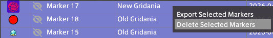
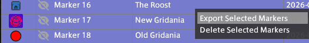
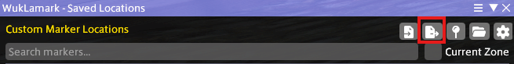
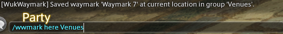
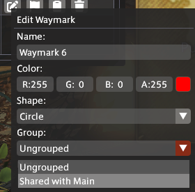

# WukLamark
A Final Fantasy XIV plugin for making custom map markers around Eorzea.

<!-- | Table View | Group View |
| :---: | :---: |
|  |  | -->

## What is WukLamark?

WukLamark is a plugin that allows players to create and manage custom map markers around Eorzea. Whether it's that one spot you use often for GPosing, a venue you frequented once but decided to go again or simply anything that you find interesting, WukLamark will allow you to create a custom map marker for it and make it appear on both the main map and the minimap itself! Think of it as `<flag>` but permanent.

## Features
- Create and manage persistent custom map markers.
- Configure how map markers are displayed on the map and minimap.
- Set how map markers look on the map and minimap using shapes or in-game icons.
- Add personal notes to map markers.
- Set different map marker visibility settings for map markers (per-character vs shared on this PC).
- Crossworld markers (appear on matching maps across worlds/data centers).
- Group map markers for different purposes.
- Batch import/export map markers to share with your friends.
- Customize the colors of in-game icons.
- Display in-game locations (territory/world/ward) by name.

## How To Use

### Creating a Map Marker

To create a map marker, you can use the `/wlmark here` command in chat or open the WukLamark window and click the `Create Marker` button.

| Command | Window Button |
| --- | --- |
|  |  |

> For the GUI, holding `Shift` while clicking the `Create Marker` button will create a Crossworld map marker instead of a world-specific map marker.

### Editing a Map Marker

To edit a map marker, open the WukLamark window and click the `Edit Marker` button.

> `Shape` is only applicable to No Icon map markers. `Scope` is only applicable to map markers that are not in a group. Map markers in a group will inherit the scope of the group. `Color` is only applicable to No Icon map markers unless `Apply Shape Color to Icon` is enabled.

### Making a Map Marker Global

To make a map marker global, open the WukLamark window and click the `Edit Marker` button. Then, click the `Visible Crossworld` checkbox.

### Deleting a Map Marker(s)

#### Deleting a Single Map Marker

To delete a map marker, open the WukLamark window, right-click the marker you wish to delete and click the `Delete Marker` button.

#### Deleting Multiple Map Markers

To delete multiple map markers, open the WukLamark window, shift-click or ctrl-click the markers you wish to delete, right-click any of the selected markers and click the `Delete Selected Markers` button.

> If you select a marker that you do not have permission to delete, it will not be included in the deletion and the delete button may be grayed out or say `Delete N of Y Markers`.

### Sharing a Map Marker

#### Sharing a Single Map Marker

To share a map marker with others, open the WukLamark window, right-click the marker you wish to share and click the `Copy to Clipboard` button.

#### Sharing Multiple Map Markers

To share multiple map markers with others, open the WukLamark window, shift-click or ctrl-click the markers you wish to share, right-click any of the selected markers and click `Export Selected Markers`.

   > Alternatively, you can click the `Export Selected Marker(s) to Clipboard` button at the top of the window.

   

### Importing Map Markers

To import map markers from someone else, open the WukLamark window and click the `Import Markers from Clipboard` button.

## Groups

### Creating a Group

A group is a collection of map markers. To create a group, switch to the Group View and click the + button to create a group.

|     |     | 
| :-: | :-: |
|  | 

### Adding a Map Marker to a Group

**New Map Markers**
| Command | Window Button |
| --- | --- |
|  |  
|

> For the GUI, holding `Shift` while clicking the `Create Marker` button will create a Crossworld map marker instead of a world-specific map marker in the group.

**Existing Map Markers**

## Editing a Group

To edit a group, click the `...` button on the right-side of the group header and click `Edit Group`.

> This ability is grayed-out for Shared groups set to read-only for non-owners.

## Deleting a Group

To delete a group, click the `...` button on the right-side of the group header and click `Delete Group`.

> This ability is grayed-out for Shared groups set to read-only for ALL users. Owners of groups wishing to delete groups should turn off read-only mode before deleting. If map markers exist in the group you wish to delete, you will be asked whether to keep them or not.

## Exporting Group Markers

To export all markers in a group, click the `...` button on the right-side of the group header and click `Export Markers`.

## Importing Group Markers

To import markers into a group, click the `Import` button on the right-side of the group header.

## Configuration

### Enable Marker Display on Map
> This option allows you to enable or disable the display of map markers on the main map.

### Enable Marker Display on Minimap
> This option allows you to enable or disable the display of map markers on the minimap.

### Default Marker Icon/Shape Size
> This sets the default size of map markers on the map and minimap. To override this, edit the marker and change the size under `Shape/Icon Size`.

### Fade Markers on Minimap Edge
> This option toggles the fade effect map markers apply to themselves when at the edge of the minimap.

### Fade Markers on Map Edge
> This option toggles the fade effect map markers apply to themselves when at the edge of the map.

### Edge Fade Opacity
> This option allows you to change the opacity of the fade effect map markers apply to themselves when at the edge of the map or minimap.

### Default Shape for New Markers
> This option allows you to change the default shape for new map markers. (Only applicable to No Icon map markers)

### Show Tooltips on Hover
> This option allows you to enable or disable the display of tooltips on hovering over a map marker (mostly for the name of the map marker).

### Erase All Created Markers
> This option allows you to clear all map markers created by you from the map and minimap.  

## Building from Source

### Prerequisites
- .NET 10 SDK
- Visual Studio 2026
- Dalamud (via XIVLauncher)

### Building
> This assumes that XIVLauncher is already installed.

1. Clone this repository
2. Open the solution in Visual Studio 2026
3. Build the solution

