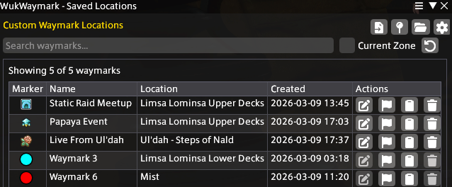

# WukWaymark
A Final Fantasy XIV plugin for making custom waymarks around Eorzea.

## What is WukWaymark?

WukWaymark is a plugin that allows players to create and manage custom waymarks around Eorzea. Whether it's that one spot you use often for GPosing, a venue you frequented once but decided to go again or simply anything that you find interesting, WukWaymark will allow you to create a custom waymark for it and make it appear on both the main map and the minimap itself! Think of it as `<flag>` but permanent.

## Features
- Create and manage custom waymarks
- Configure how waymarks are displayed on the map and minimap
- Set different icons for waymarks (shapes)
- Add personal notes to waymarks
- Displays in-game locations and world locations by name

## How To Use

### Creating a Waymark

To create a waymark, you can use the `/wwmark here` command in chat or open the WukWaymark window and click the `Create Waymark` button.

| Command | Window Button |
| --- | --- |
|  |  |

### Editing a Waymark

To edit a waymark, open the WukWaymark window and click the `Edit Waymark` button.

You can change the name of the waymark, the icon of it, what group its in, add a note, who can see it and more!
> At the moment, `Color` is only applicable to No Icon Waymarks. 

### Deleting a Waymark

To delete a waymark, open the WukWaymark window and click the `Delete Waymark` button.

### Sharing a Waymark to Others Using WukWaymark

To share a waymark with others, open the WukWaymark window and click the `Copy to Clipboard` button.

To import a waymark from someone else, open the WukWaymark window and click the `Import Waymarks from Clipboard` button.

### Creating a Group

A group is a collection of waymarks. To create a group, switch to the Group View and click the + button to create a group.

|     |     | 
| :-: | :-: |
|  | 

### Adding a Waymark to a Group

**New Waymarks**
| Command | Window Button |
| --- | --- |
|  |  
|

**Existing Waymarks**

## Editing a Group

To edit a group, click the pencil icon on the right-side.
> This ability is grayed-out for Shared groups set to read-only (only editable by the owner of the group).

## Deleting a Group

To delete a group, click the trash icon on the right-side.
> This ability is grayed-out for Shared groups set to read-only for ALL users. Owners of groups wishing to delete groups should turn off read-only mode before deleting. If waymarks exist in the group you wish to delete, you will be asked whether to keep them or not.

## Configuration

### Enable Waymark Display on Map
> This option allows you to enable or disable the display of waymarks on the main map.

### Enable Waymark Display on Minimap
> This option allows you to enable or disable the display of waymarks on the minimap.

### Marker Size
> This option allows you to change the size of the waymarks on the map and minimap. (Only applicable to No Icon waymarks)

### Fade Waymarks on Minimap Edge
> This option toggles the fade effect waymarks apply to themselves when at the edge of the minimap.

### Fade Waymarks on Map Edge
> This option toggles the fade effect waymarks apply to themselves when at the edge of the map.

### Edge Fade Opacity
> This option allows you to change the opacity of the fade effect waymarks apply to themselves when at the edge of the map or minimap.

### Default Shape for New Waymarks
> This option allows you to change the default shape for new waymarks. (Only applicable to No Icon waymarks)

### Show Tooltips on Hover
> This option allows you to enable or disable the display of tooltips on hovering over a waymark (mostly for the name of the waymark).

### Erase All Created Waymarks
> This option allows you to clear all waymarks created by you from the map and minimap.  

## Building from Source

### Prerequisites
- .NET 10 SDK
- Visual Studio 2026
- Dalamud (via XIVLauncher)

### Building
> This assumes that XIVLauncher is already installed.

1. Clone this repository
2. Open the solution in Visual Studio 2026
3. Build the solution

