# WukLamark
A Final Fantasy XIV plugin for making custom map markers around Eorzea.

| Table View | Group View |
| :---: | :---: |
| 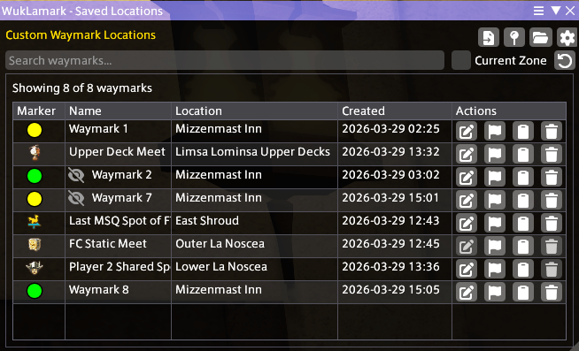 | 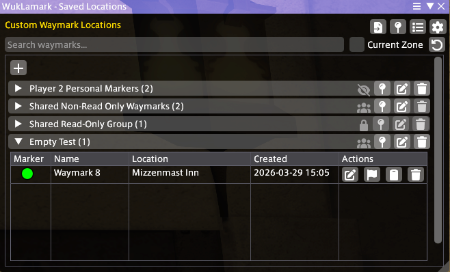 |

## What is WukLamark?

WukLamark is a plugin that allows players to create and manage custom map markers around Eorzea. Whether it's that one spot you use often for GPosing, a venue you frequented once but decided to go again or simply anything that you find interesting, WukLamark will allow you to create a custom map marker for it and make it appear on both the main map and the minimap itself! Think of it as `<flag>` but permanent.

## Features
- Create and manage custom map markers
- Configure how map markers are displayed on the map and minimap
- Set different icons for map markers (shapes or game icons)
- Add personal notes to map markers
- Set different scopes for map markers (personal, shared)
   > Shared map markers are visible to anyone who logs into the game from your computer.
- Per-character map markers
- Group map markers for different purposes
- Import map markers from other players/Export map markers to other players
- Displays in-game locations and world locations by name

## How To Use

### Creating a Map Marker

To create a map marker, you can use the `/wlmark here` command in chat or open the WukLamark window and click the `Create Marker` button.

| Command | Window Button |
| --- | --- |
| 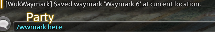 | 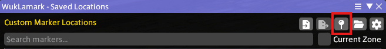 |

### Editing a Map Marker

To edit a map marker, open the WukLamark window and click the `Edit Marker` button.

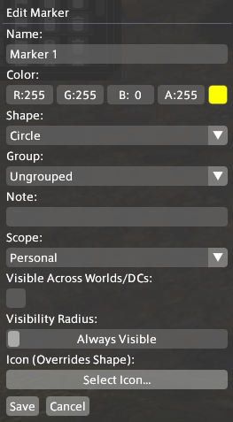

> `Color` and `Shape` are only applicable to No Icon map markers. Scope is only applicable to map markers that are not in a group. Map markers in a group will inherit the scope of the group. 

### Deleting a Map Marker

To delete a map marker, open the WukLamark window and click the `Delete Marker` button.

### Sharing a Map Marker to Others Using WukLamark

To share a map marker with others, open the WukLamark window and click the `Copy to Clipboard` button.

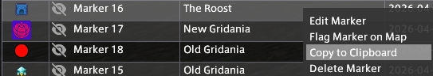

To import a map marker from someone else, open the WukLamark window and click the `Import Map Markers from Clipboard` button.

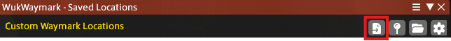

### Creating a Group

A group is a collection of map markers. To create a group, switch to the Group View and click the + button to create a group.

|     |     | 
| :-: | :-: |
| 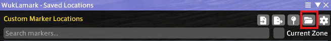 | 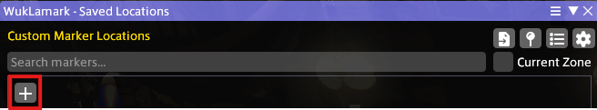

### Adding a Map Marker to a Group

**New Map Markers**
| Command | Window Button |
| --- | --- |
|  |  
|

**Existing Map Markers**

## Editing a Group

To edit a group, click the pencil icon on the right-side.
> This ability is grayed-out for Shared groups set to read-only (only editable by the owner of the group). Non-owners can only edit the name of Shared groups for non-read-only groups.

## Deleting a Group

To delete a group, click the trash icon on the right-side.
> This ability is grayed-out for Shared groups set to read-only for ALL users. Owners of groups wishing to delete groups should turn off read-only mode before deleting. If map markers exist in the group you wish to delete, you will be asked whether to keep them or not.

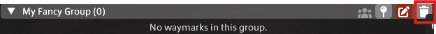

## Configuration

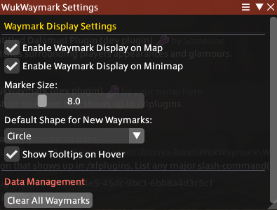

### Enable Map Marker Display on Map
> This option allows you to enable or disable the display of map markers on the main map.

### Enable Map Marker Display on Minimap
> This option allows you to enable or disable the display of map markers on the minimap.

### Marker Size
> This option allows you to change the size of the map markers on the map and minimap. (Only applicable to No Icon map markers)

### Fade Map Markers on Minimap Edge
> This option toggles the fade effect map markers apply to themselves when at the edge of the minimap.

### Fade Map Markers on Map Edge
> This option toggles the fade effect map markers apply to themselves when at the edge of the map.

### Edge Fade Opacity
> This option allows you to change the opacity of the fade effect map markers apply to themselves when at the edge of the map or minimap.

### Default Shape for New Map Markers
> This option allows you to change the default shape for new map markers. (Only applicable to No Icon map markers)

### Show Tooltips on Hover
> This option allows you to enable or disable the display of tooltips on hovering over a map marker (mostly for the name of the map marker).

### Erase All Created Map Markers
> This option allows you to clear all map markers created by you from the map and minimap.  

## Building from Source

### Prerequisites
- .NET 10 SDK
- Visual Studio 2026
- Dalamud (via XIVLauncher)

### Building
> This assumes that XIVLauncher is already installed.

1. Clone this repository
2. Open the solution in Visual Studio 2026
3. Build the solution

